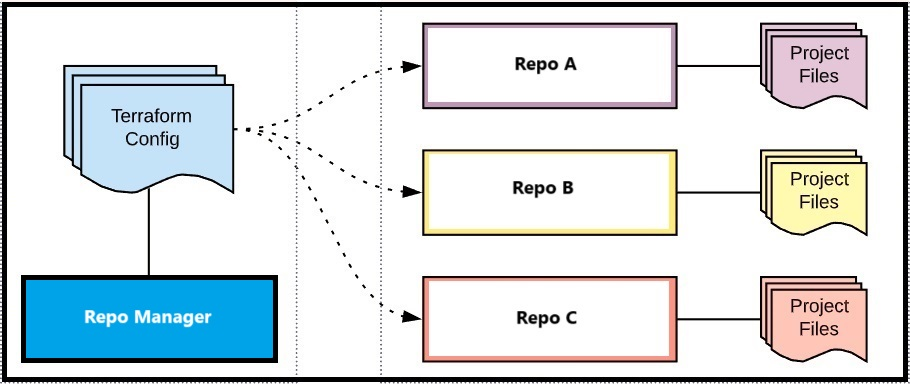

# FULLSTACK CONTAINERIZATION WITH TERRAFORM

## Introduction
Terraform is a powerful tool to use code to deploy, secure and manage repositories. This project is based on GitHub-repo below:

https://github.com/dhomi/fullstack_conteinerized 

### A scenario:
- As a DevOps specialist
- I would like to use an IaC tool in Windows OS
- In order to manage my complete fullstack container environment from a repo

## How-To
1) Download/Install [Docker Desktop](https://docs.docker.com/desktop/) 
2) Download/Install [NodeJS](https://nodejs.org/en/download/package-manager)
3) Download/Install [Terraform](https://developer.hashicorp.com/terraform/install)
4) Add "terraform.exe" into (Windows) environment variables
5) See for instructions starting the fullstack container environment: 
    - https://github.com/dhomi/fullstack_conteinerized 

## Start with Terraform

1) Pre-condition: step 3 and 4 from "How-To" are done
2) Create a local folder for your Terraform project including the config file "main.tf"
3) In the "main.tf" add the needed providers (in this case: GitHub provider)
	- See complete list of providers: https://registry.terraform.io/browse/providers
4) Set-up Terraform [GitHub provider](https://registry.terraform.io/providers/integrations/github/latest/docs)
5) ...

## Design Overview

Terraform will be used to build different repositories located in different cloud platforms. The Terraform code is stored in this repository as a "Repo Manager" to manage the different repositories (see design overview below).

## TO DO

- Complete steps "Start with Terraform"
- Complete Terraform configuration to use GitHub repo template(s)
- Set-up process to monitor and manage Terraform flow 